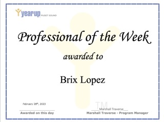
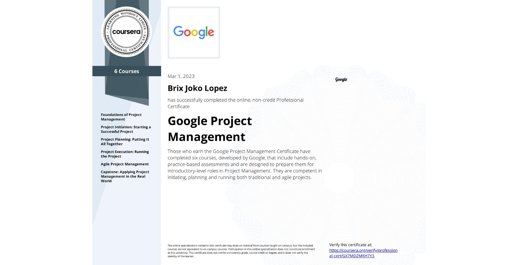
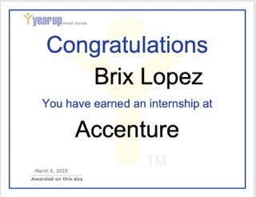

# MyProfile

## Welcome to my Profile!

---
---
# Bio
### Brix Lopez here. My love is working with computers, and I'm now pursuing a project management certificate at Year Up. I am really motivated to put my knowledge and talents to use in order to assist firms in streamlining their operations and effectively achieving their objectives. I'm excited to use my experience in project management and technical background to contribute to the tech sector. If you give me the chance, I'd love to talk with you more about how I might help your team. Let's connect and explore the ideas.
---
---
# Journey
### My journey at Year Up was enjoyable and challenging, and I learned a lot of new things in a fast-paced environment. I like the learning process, which has asynchronous and synchronous classes that help me manage my time and knowledge on consuming information. The support of each staff helps me enhance my professional skills and allows me to pursue a career in Project Management. I also appreciate my classmates encouraging everyone to finish an assignment and activities, and their support motivates me to improve every day. 
---
---
# Accomplishment
### I am honored to be the Professional of the Week, awarded last February 28th, 2023, from our Learning and Development pace at Year Up Project Management Certificate. This award made me proud that in any environment I am, I always accomplish something that will make me grow and improve. I also finished the Google Coursera Project Management Certificate, which led me to earn an internship at Accenture. I can't believe I accomplished this achievement in just three months, and I look forward to learning more and growing throughout my journey at Year Up.
## Professional of the week

## Coursera Certificate

## Internsip 

---
---
## Contact 
### Please feel free to contact me on this links
[LinkedIn](https://www.linkedin.com/in/brixlopez/)
[GitHub](brixlopez.github.io/MyProfile/)

